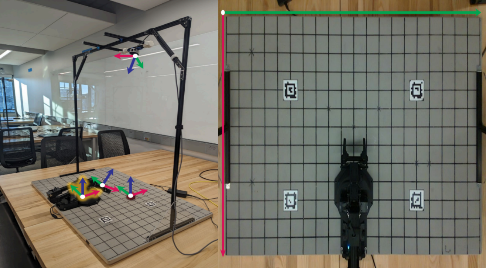
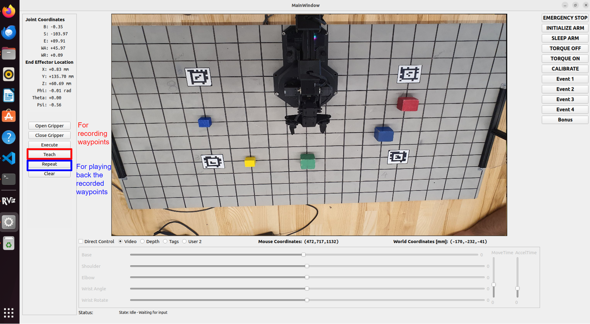
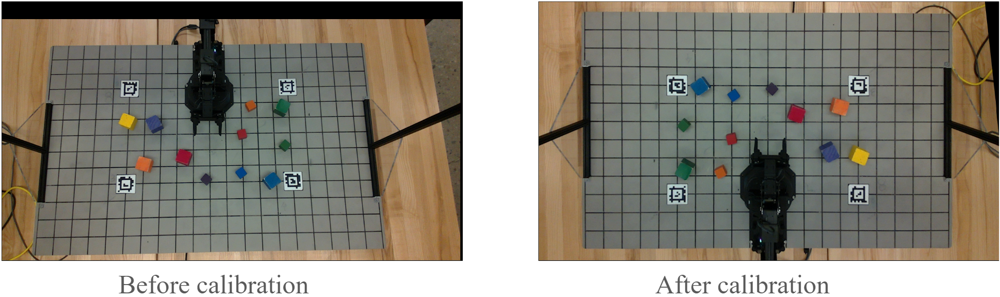
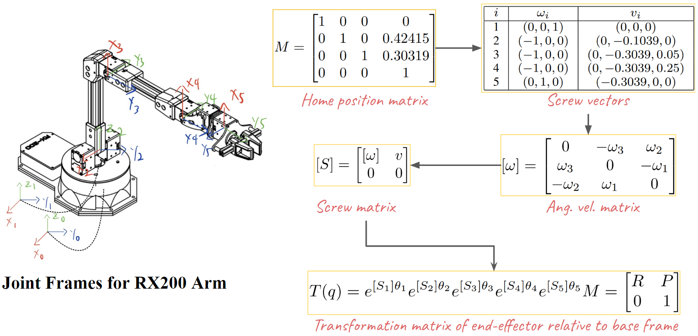
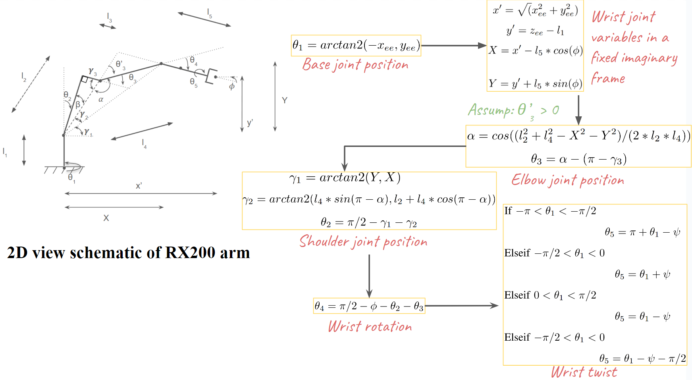
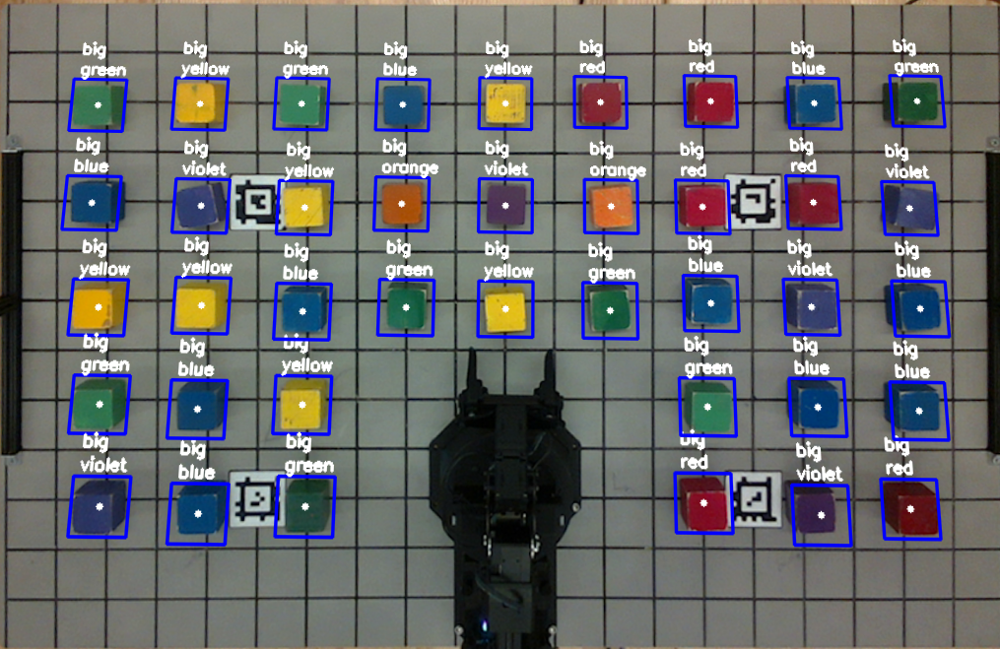

## 🤖 KinoVision
- Note: This group project was completed as part of the **ROB 550: Robotic Systems Lab** course between January and March 2024. The original code is hosted on [GitLab](https://gitlab.eecs.umich.edu/armlab-s012-g1/armlab-f23.git). This GitHub version is built to demonstrate the results and allow users to smoothly follow the steps.<br>
- Report: [Armlab](https://drive.google.com/file/d/19UP8UG3t_4UYOeVGo8vzhoAtccAKI-aY/view?usp=drive_link)

<div style="width: 100%; text-align: center; margin:auto;">
      
</div>

### 🎯 Goal
Develop computer vision algorithms and work with the kinematics of a 5-DOF manipulator to detect and manipulate blocks on a board within the reach of the robot arm.

## ⚙️ Prerequisites
### 🖥️ Hardware
- [ReactorX 200 Robot Arm] (https://docs.trossenrobotics.com/interbotix_xsarms_docs/specifications/rx200.html): 5 DOF manipulator
- 7 Dynamixel Servo Motors: 6 [XL430-W250-T](https://emanual.robotis.com/docs/en/dxl/x/xl430-w250/) motors + 1 [XM430-W350-T](https://emanual.robotis.com/docs/en/dxl/x/xm430-w350/) motor for the wrist
- Serial Interface & Power: Dynamixel servos use a three-wire connection and are all wired up in parallel. Data is carried using a [half-duplex asynchronous serial protocol](https://learn.sparkfun.com/tutorials/serial-communication/all#:~:text=Half%2Dduplex%20communication%20means%20serial,back%20to%20the%20controlling%20device.), meaning transmit and receive data are carried on the same physical wire at a fixed (1Mbps) baud rate
- Realsense Sensor L515: Consists of an RGB camera and a solid-state LIDAR

### 💻 Software
- ROS2 Humble
- Realsense2_camera: ROS driver node for the Realsense camera. It enables us to stream the camera output as a ROS message. You can find information on the Intel RealSense [GitHub](https://github.com/IntelRealSense/realsense-ros)
- interbotix_sdk: ROS driver node for the Interbotix Robot Arm. This node allows us to subscribe to topics relating to the joint states, representing the angle of the joints read from the motors. You can find more information on the [GitHub](https://github.com/Interbotix/interbotix_ros_manipulators)

## 🗂️ Code structure
- [install_scripts](install_scripts)
    - [install_scripts/config](install_scripts/config)
        - `rs_l515_launch.py` - to launch the camera
        - `tags_Standard41h12.yaml` - to define the april tags used on the board
    - `install_Dependencies.sh` - to install ROS2/All the ROS wrappers/Dependencies
    - `install_Interbotix.sh` - to install arm related stuff
    - `install_LaunchFiles.sh` - to move the files under `/config` to where it should to be 
- [launch](launch) - to store the launch files
- [src](src) - where the actual code written
    - `camera.py` - Implements the Camera class for the RealSense camera. 
        - Functions to capture and convert frames
        - Functions to load camera calibration data
        - Functions to find and perform 2D transforms
        - Functions to perform world-to-camera and camera-to-world transforms
        - Functions to detect blocks in the depth and RGB frames
    - `control_station.py`
         - This is the main program. It sets up the threads and callback functions. Takes flags for whether to use the product of exponentials (PoX) or Denabit-Hartenberg (DH) table for forward kinematics and an argument for the DH table or PoX configuration.
    - `kinematics.py` - Implements functions for forward and inverse kinematics
    - `rxarm.py` - Implements the RXArm class
        - Feedback from joints
        - Functions to command the joints
        - Functions to get feedback from joints
        - Functions to do FK and IK
        - A run function to update the dynamixiel servos
        - A function to read the RX200 arm config file
    - `state_machine.py` - Implements the StateMachine class
        - The state machine is the heart of the controller
- [config](config)
    - `rx200_dh.csv` - Contains the DH table for the RX200 arm
    - `rx200_pox.csv` - Containes the S list and M matrix for the RX200 arm.

## 🛠️ Installation
1. Clone this repository
```
git clone https://github.com/SuryaPratapSingh37/KinoVision.git
```
2. Install all the dependencies and packages
```
cd KinoVision/install_scripts
./install_Dependencies.sh
```
Wait until it's complete before proceeding to the next step.
3. Install arm related stuff - [Source](https://docs.trossenrobotics.com/interbotix_xsarms_docs/ros_interface/ros2/software_setup.html)
```
./install_Interbotix.sh
```
During the installation, you'll encounter prompts. For prompts related to AprilTag and MATLAB-ROS installation, type no and press Enter. Wait until it's complete before proceeding to the next step.
4. Move config files
```
./install_LaunchFiles.sh
```
This file is used to move the config files. The configurations are based on the AprilTag family we have and the specific camera model we use.
5. Install camera calibration package
- Open a new terminal, then copy and run the following command
```
./install_Calibration.sh
```
- (Optional) To verify environment setup, open a new terminal and run
```
printenv | grep ROS
```
- The above should print all the environment variables associated to ROS
6. Now reboot the computer
```
sudo reboot
```
7. Testing the installation
- Connect the camera USB and arm USB to the computer, then open a terminal
```
cd KinoVision/launch
chmod +x launch_armlab.sh
./launch_armlab.sh
```
The above starts 3 nodes: camera, apriltag, interbotix_arm
- Open another terminal
```
cd KinoVision/launch
chmod +x launch_control_station.sh
./launch_control_station.sh
```
This one starts the control station GUI, and validation succesful setup of the package

## 🔄 Control station pipeline
<div style="width: 100%; text-align: center; margin:auto;">
      
</div>

## 📊 Results
### 📈 Teach-and-Repeat motion
- Added two buttons to the Control station GUI
- To perform the operation of swapping of two blocks, trajectory waypoints were recorded using 'Teach' button, while 'Repeat' button is used to play back the recorded waypoints.
For path planning, a low-level PID-controller is used in the joint space.

<div style="display: flex; justify-content: center; align-items: center;">
    
    
</div>

### 📏 Camera calibration
#### 🛠️ (Optional) Intrinsic camera calibration
- This is Optional because the camera comes with an internal factory calibration. But there's always some possibility, if over time the camera has gone physical alterations or damages, then the intrinsic calibration parameters might have changed. For this you'll require a checkerboard
- Start Realsense2 camera node
```
ros2 launch realsense2_camera rs_l515_launch.py
```
- Start AprilTag Dectection node
```
ros2 run apriltag_ros apriltag_node --ros-args \
      -r image_rect:=/camera/color/image_raw \
      -r camera_info:=/camera/color/camera_info \
      --params-file `ros2 pkg prefix apriltag_ros`/share/apriltag_ros/cfg/tags_Standard41h12.yaml
```
- Start the arm node
```
ros2 launch interbotix_xsarm_control xsarm_control.launch.py robot_model:=rx200
```
This command will launch rviz with the virtual robot model, the model would show exactly how the arm is moving.
- Start the camera calibration node
```
cd ~/image_pipeline
source install/setup.bash
# the size of the checkerboard and the dimensions of its squares may vary
ros2 run camera_calibration cameracalibrator --size 6x8 --square 0.025 \
    --no-service-check --ros-args \
    -r image:=/camera/color/image_raw  \
    -p camera:=/camera
```
This will open a calibration window. Move the checkerboard in front of the camera in various positions and orientations until you see all the 4 bars (X, Y, Size, Skew) in green (the longer the bars the better calibration it would be) in the window. When satisfied, click on 'Calibrate' and 'Save'.

### 🔧 Automatic Extrinsic (& homography) camera calibration using GUI
<div style="width: 100%; text-align: center; margin:auto;">
      
</div>

- Validating the robustness (by manually changing the camera orientation), also drawing the grid points post-calibration

<div style="width: 100%; text-align: center; margin:auto;">
      
</div>

### 🤖 Kinematics
#### 📐 Forward kinematics (Product of exponentials approach)
<div style="width: 100%; text-align: center; margin:auto;">
      
</div>

#### 🔄 Inverse kinematics (Analytical approach)
<div style="width: 100%; text-align: center; margin:auto;">
      
</div>

### 🧱 Block detection
<div style="width: 100%; text-align: center; margin:auto;">
      
</div>

### 🖱️ Click to Grab/Drop (via GUI)
<div style="width: 100%; text-align: center; margin:auto;">
      
</div>

### 📦 Automatic Sorting of the blocks (based on size)
<div style="width: 100%; text-align: center; margin:auto;">
      
</div>

## 🙏 Credits

This project would not have been successful without the invaluable guidance and support of:

- Dr. Peter Gaskell
- Dr. Greg Formosa
- Abhishek Narula

Special thanks to my team members:

- Guangyi Liu
- Jayaprakash Harshavardhan
